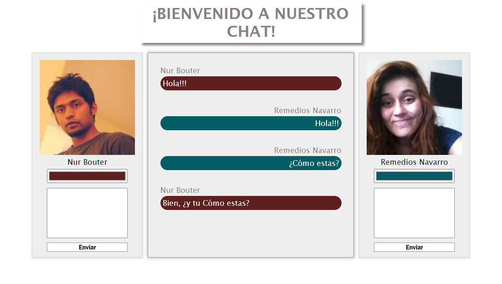

.
.
# Chat Interactivo
Este proyecto utiliza Vue.js para crear una aplicación de chat entre dos usuarios simulados obtenidos aleatoriamente desde la API de Random User.

Desarrolladora: Ana Celeste Pérez

## Características
`Interfaz de Usuario Amigable`:Interfaz sencilla y limpia para enviar mensajes entre dos usuarios.

`Personalización`: Cada usuario puede elegir el color de fondo de sus mensajes.

`Funcionalidad de Envío Instantáneo`: Los mensajes se envían presionando Enter o haciendo clic en el botón "Enviar".
Persistencia de Mensajes: Los mensajes enviados se muestran en tiempo real dentro del chat interactivo.

## Tecnologías Utilizadas

`Vue.js:` Framework JavaScript progresivo para la construcción de interfaces de usuario.

`Axios:` Cliente HTTP basado en Promesas para realizar peticiones a la API de Random User.

### Algunos detalles...

-No se si es un "error o un bug", pero al cambiarle los estilos a cualquier componente ya sea app o ChatInteractivo, se duplica el chat que esta en el "main" en su totalidad, dejare una imagen de referencia..

.

-Tuve que usar la inteligencia articial, ya que se me hizo dificil poder conectar el componente `ChatInteractivo`. Por eso no hice el tercer componente, la idea principal era hacer un componente para la ventana del usuario, la del chat general y renderizar todo en app. "No logrado   :(". Tambien para que el texto de cada usuario quedara para lados diferentes. 
-$Emit

-La api Random User igual fue algo compleja, ya que habia que colocarle un extra en el URL :
'https://randomuser.me/api?results=2' RESULT="2" o cualquier otro número.

-Tuve que agregarle al "main" la directiva `v-if`  
```<main v-if="user1 && user2">```, para que no me arrojara error en la consola, OJO: en la interfaz grafica se podia visualizar igual. Dejo una imagen de referencia:
.
### Cosas mas sencillas
Las directivas, props, bindear.
### Nota
¡Se aceptan feedbacks!
